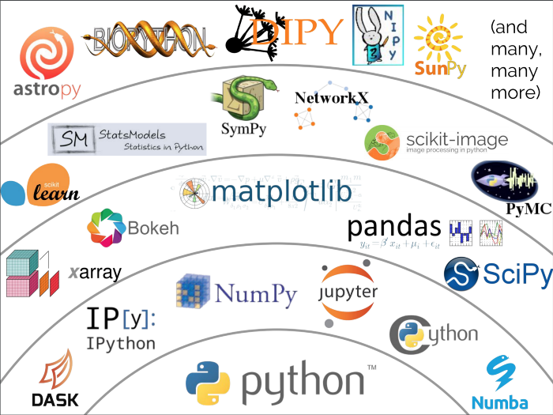

# Python Landscape and Introduction

## Python Landscape

*Python ecosystem. Source: Jake Vanderplas 2017 PyCon Keynote.*

Python is the fundamental language surrounded by many packages built on top of Python. These packages then built on top of each other and work collaboratively form the Python ecosystem.

The first layer of packages on top of the Python language consists some of the fundamental tools. IPython and Jupyter Notebook are interactive interface for people to write and test code in. Numpy is the foundation of lots of Python packages. Numpy stores data in an N-dimensional array data structure and supports computations with its N-dimensional array objects. Cython, Dask, and Numba are all about making Python code run faster. Cython is the C-extensions for Python. Dask provides parallel computing across clusters and threads. Numba compiles Python codes to optimized machine code. Those libraries are especially useful if you care about your code performance or if your code just takes too long to run. Finding options in Dask or Numba might save you lots of time.

The second layer of packages are our every day use packages built on top of the fundamental packages we just talked about. Pandas is probably everyone’s favorite for data manipulation. Matplotlib and Bokeh are low-level visualization packages. If you want to learn more about Python visualization packages, check out my other post on [Python visualization landscape](https://medium.com/@lulunana/python-visualization-landscape-3b95ede3d030).

Then we have some computational and analytical packages built on top of the second layer packages. And finally we have more specialized packages for different industries and use cases. Of course, there are many many more packages built for different usage. The fact is whatever you want to do, there will be likely a package there in Python already. If not, you can always easily implement your own functions or even write up your own packages and contribute to the Python ecosystem.

## Installation
The most popular method for installing Python is to use Anaconda Distribution or Miniconda.

### Anaconda Distribution
If you are new to Python, Anaconda distribution is your best friend.

"Anaconda is a package manager, an environment manager, a Python/R data science distribution, and a collection of over 1,500+ open source packages.(https://docs.anaconda.com/anaconda/)"

Anaconda comes with everything you will need when you first start coding with Python. In terms of Python packages, it has over 250 packages when you download Anaconda. If you need more packages, you can use conda install command to install over 7500 packages from Anaconda repository and thousands of other packages from Anaconda Cloud. If you are a fan of pip, Anaconda works well with pip. You can also use pip install commands to install pip packages that are not available in conda. Most packages you will ever need is probably in conda.

Anaconda distribution also includes Anaconda Navigator and conda. Anaconda Navigator is a desktop graphical user interface. You can launch your favorite Python IDE (e.g., Jupyter Notebook, VS code) from Anaconda Navigator and you can manage your packages here without tying any command line commands. conda is an amazing package management and environment management system. You can use all kinds of conda commands to install, update packages and create, manage enviornment. If you would like to know more about conda, check out my [intro to conda article](https://sophiamyang.github.io/DS/basics/conda.html).

To download Anaconda Distribution, go here: https://www.anaconda.com/distribution/ and download the Python 3.7 version. Nobody uses Python 2.7 anymore. So don’t download Python 2.7.

## Miniconda

"Miniconda is a free minimal installer for conda. It is a small, bootstrap version of Anaconda that includes only conda, Python, the packages they depend on, and a small number of other useful packages, including pip, zlib and a few others. (https://docs.conda.io/en/latest/miniconda.html)"

Miniconda only comes with conda, and few essential packages. It does not Anaconda Navigator. The main advantage of Miniconda is that it is fast and need less space on disk. Developers usually prefer to use Miniconda.

To install Miniconda, you can download the Miniconda installer https://docs.conda.io/en/latest/miniconda.html by clicking on the correct installer or use curl command to download it from the command line. Then you can run `bash Miniconda3-xxx.sh` to install the installer.

## How to use Python
There are many ways people write Python code and execute Python code. Here are the four most common ways:

- Jupyter Notebook/JupyterLab (interactive interface in the browser)
`conda install jupyter notebook` and run `jupyter notebook` in the command line
or open it directly from Anaconda Navigator.

- Ipython (interactive interface in the command line)
`conda install ipython` (included in Anaconda distribution) and then run `ipython` in the command line

- VS code (to write Python)
My favorite tool to write Python in is VS code. Some people prefer other text editing tools like vim, emacs, or nano. But I love VS code and you can add the Jupyter notebook extention in VS code and run code cell by cell in VS code. To use it — launch VS code, start New file, select Python, write your Python code, and save to a .py file.

- Command line interface (to run Python executables)
Run `python file.py` directly in the command line.

Now you have all the tools you need to start programming in Python!

By Sophia Yang on [November 13, 2019](https://sophiamyang.medium.com/introduction-to-python-landscape-and-installation-d9b212ec9d82)