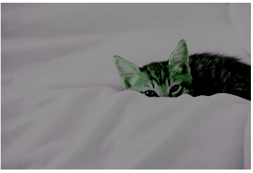

# Deep learning basics — data augmentation


## Why do we need data augmentation?
- Not enough data. Some models might require lots of data that we do not currently have. We can use data augmentation to create a lot more data for us.
- Overfitting. We may want to capture more invariances in our data if the model overfits.
- Improve model performance. Avoiding overfitting subsequently improves our model performance. Also if you get stuck in your model training and not see any performance improvement after a while, data augmentation might help you get unstuck.

## How do we do data augmentation?
Our goal is to get **randomly** augmented images for training. There are many different ways to augment your image. [Pytorch documentation](https://pytorch.org/docs/stable/torchvision/transforms.html) listed lots of functions. Here are some good ones to use:
- Random horizontal flip `torchvision.transforms.RandomHorizontalFlip`: Horizontally flip the image randomly.

- Random resize crop `torchvision.transforms.RandomResizedCrop`: Randomly crop the image.

- Random rotation `torchvision.transforms.RandomRotation`: Randomly rotate the image with a range of angles to select from.

- Randomly change the brightness, contrast, and saturation of an image `torchvision.transforms.ColorJitter`


The augmentations I listed above all have a random component in it. It is very important to randomly augment your images so that we get to see different images/data for every iteration. Also, note that we can combine all these different data augmentations together `usingtorchvision.transforms.Compose`.

Actually, we need to use `torchvision.transforms.Compose` for single data augmentation also, since we need to convert the images to tensor before we load the data to our model (e.g., `torchvision.transforms.Compose(
[torchvision.transforms.RandomHorizontalFlip(),torchvision.transforms.ToTensor()])`).

And here is an example of combined data augmentations: 
```
torchvision.transforms.Compose(
    [torchvision.transforms.RandomHorizontalFlip(), 
    torchvision.transforms.RandomResizedCrop((200,200)), 
    torchvision.transforms.ColorJitter(brightness=0.9, contrast=1, saturation=0.7, hue=0), 
    torchvision.transforms.ToTensor()])
```

Below is the code (using PyTorch) for generating the image at the top of this article. If you want to use other libraries to do data augmentation, this article summaries various methods and implementations using a couple of different libraries.
Hope you enjoy it! Thanks!

<script src="https://gist.github.com/sophiamyang/964c0a947d75c810282172a3251e8afa.js"></script>

By Sophia Yang on [September 2, 2020](https://medium.com/analytics-vidhya/deep-learning-topics-data-augmentation-a0d2f9ecdd66).