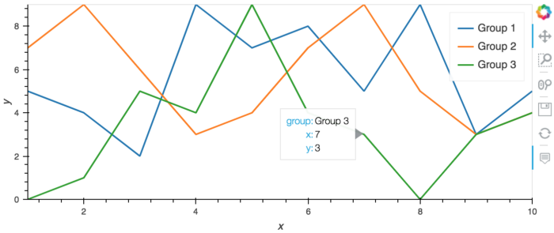

# Python Visualization — Multiple Line Plotting

Multiple line plotting is easy to do in Python. There are many ways people can do this with various Python visualization tools, e.g., matplotlib, seaborn, bokeh, holoviews, and hvplot. Here I am demonstrating how I plot multiple lines in bokeh and hvplot. For your reference, the package versions I used for this article are: Python 3.8.2, hvplot 0.6.0, and bokeh 2.1.0.

To get started, let’s create a very simple dataset with three variables — x, y, and group.
```
import numpy as np 
import pandas as pd
group = np.repeat(['Group 1', 'Group 2','Group 3'], 10)
x = list(range(1,11))*3
y = np.random.randint(10, size=30)
df = pd.DataFrame({'group': group,'x': x,'y': y})
```

Our goal is to create a multiple line plot by group like the figure showing below. And I would like to see the tooltips of the mouse pointer.



## hvplot
The easiest approach is hvplot. hvplot is a high-level plotting tool built on Holoviews. It’s super easy to use and the output figure is formatted perfectly. With two lines of code below, we can get the desired results.
```
import hvplot.pandas
p1= df.hvplot('x','y',by='group')
p1
```

## bokeh
I also like to use bokeh. Bokeh is a lower-level plotting API, which gives me a lot of control over things I want to do. I can easily adjust things and add features with Bokeh. There are multiple ways to do multiple line plotting in bokeh. First, we can loop through the column data source for each group and create each line for each group. Second, we can use the multi_line function in bokeh. Third, we can loop through CDSView.

### Looping through column data source
We define [column data source](https://bokeh.pydata.org/en/latest/docs/user_guide/data.html) for the data we use for plotting. Column data source is especially useful if we want to create multiple plots or tables with the same data. In our example below, through a simple loop, I created three separate data sources and then three separate lines for each group. Then I added the tooltip with the HoverTool function.

```
from bokeh.io import show
from bokeh.models import ColumnDataSource
from bokeh.models import HoverTool
from bokeh.palettes import Category10
from bokeh.plotting import figure
p2 = figure(plot_width=600, plot_height=300)
grp_list = df.group.unique()
for i in range(len(grp_list)):
    source = ColumnDataSource(
        data={'x':df.loc[df.group == grp_list[i]].x,
              'group':df.loc[df.group == grp_list[i]].group,
              'y':df.loc[df.group == grp_list[i]].y})
    p2.line(x='x',
            y='y',
            source=source,
            legend_label = grp_list[i],
            color = (Category10[3])[i])
#add tool tips
hover = HoverTool(tooltips =[
     ('group','@group'),('x','@x'),('y','@y')])
p2.add_tools(hover)
show(p2)
```

## multi_line plots
We can also use [multi_line](https://bokeh.pydata.org/en/latest/docs/reference/models/glyphs/multi_line.html) in Bokeh. Note that in order to use multi_line, the data has to be re-formatted into ‘[a list of lists(https://bokeh.pydata.org/en/latest/docs/reference/models/glyphs/multi_line.html)]’, which can be annoying sometimes. In addition, In addition, it looks like some hovertool functions are not implemented correctly with multi_line plots. With the regular hovertool function, the tooltips will show all possible x, y values instead of the specific x, y value of a data point. This [issue](https://github.com/bokeh/bokeh/issues/7969) might be resolved in the future. In the meantime, I followed an example on [stackoverflow](https://stackoverflow.com/questions/50219290/bokeh-hovertool-tooltips-for-multi-line-displaying-all-coordinates-at-all-poin?rq=1). I created an invisible line of all data points and added tool tips on this invisible line. Please see my example below.
```
#bokeh - multi_line
grp_list = df.group.unique()
xs = [df.loc[df.group == i].x for i in grp_list]
ys = [df.loc[df.group == i].y for i in grp_list]
source = ColumnDataSource(data=dict(
     x = xs,
     y = ys,
     color = (Category10[3])[0:len(grp_list)],
     group = grp_list))
p3 = figure(plot_width=600, plot_height=300)
p3.multi_line(
     xs='x',
     ys='y',
     legend_group='group',
     source=source,
     line_color='color')
#Add hover tools, basically an invisible line
source2 = ColumnDataSource(dict(
     invisible_xs=df.x,
     invisible_ys=df.y,
     group = df.group))
line = p3.line(
     'invisible_xs',
     'invisible_ys',
     source=source2,
     alpha=0)
hover = HoverTool(tooltips =[
     ('group','@group'),
     ('x','@invisible_xs'),
     ('y','@invisible_ys')])
hover.renderers = [line]
p3.add_tools(hover)
show(p3)
```

## Looping through CDSView
Lastly, we can create a multiple-line plot by looping through CDSView. CDSView is “A view into a ColumnDataSource that represents a row-wise subset.” With CDSView, we can easily view the data of each group by using the GroupFilter function.
```
from bokeh.models import CDSView, GroupFilter
#bokeh - loop through CDSView
p4 = figure(plot_width=600, plot_height=300)
source = ColumnDataSource(df)
grp_list = df.group.unique()
for i in range(len(grp_list)):
    view=CDSView(source=source, 
    filters=[GroupFilter(column_name='group', group=grp_list[i])])
    p4.line(
         x='x',
         y='y',
         source=source,
         view=view,
         legend_label = grp_list[i],
         color = (Category10[3])[i])
hover = HoverTool(tooltips =[
     ('group','@group'),
     ('x','@x'),
     ('y','@y')])
p4.add_tools(hover)
show(p4)
```
Again, there are many many ways of plotting multiple lines in Python. Please let me know which tool is your favorite.

By Sophia Yang on [December 1, 2018](https://sophiamyang.medium.com/python-visualization-multiple-line-plotting-2a5483e74da6)